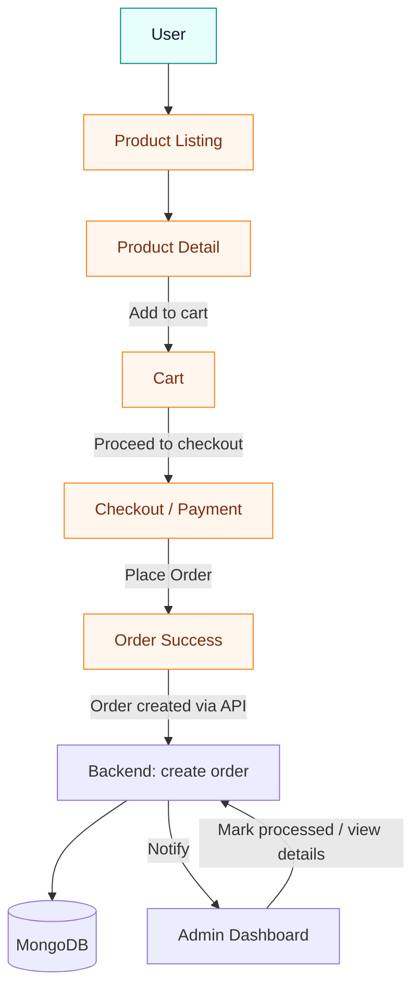

# Cartify — E-commerce Assignment

Professional, concise documentation for a full‑stack assignment. This README explains project scope, how to run the app, the architecture, and the user flow reviewers care about (product discovery → product details → cart → checkout → order confirmation → admin processing).

---

## Project summary

- Purpose: educational assignment demonstrating a maintainable full‑stack e‑commerce application.
- Stack: Node.js + Express backend, MongoDB (Mongoose) for persistence, React + Vite frontend.
- Focus: clear separation of concerns, readable code, and a small brand theme driven by `frontend/public/cartify.svg`.

## Prerequisites

- Node.js 16/18 LTS or newer
- npm (or pnpm/yarn)
- MongoDB connection (Atlas or local)

## Quick setup (development)

1. Install backend dependencies and start the API:

```bash
cd backend
npm install
# create backend/.env from backend/.env.example and set MONGO_URI, JWT_SECRET, PORT
npm run dev   # or `node server.js` depending on package.json
```

2. Install and start the frontend dev server:

```bash
cd frontend
npm install
npm run dev
```

Open the app at the Vite URL (commonly `http://localhost:5173`) and confirm API requests are routed to the backend port configured in `backend/.env`.

## Build (production)

```bash
cd frontend
npm run build
# serve frontend/dist with a static server or integrate into backend hosting

cd backend
npm run start
```

---

## Environment variables (security note)

- IMPORTANT: There is a committed `backend/.env` containing `MONGO_URI`. Treat this as leaked.

Remediation (recommended immediate commands):

```bash
# remove the file from the index but keep locally
git rm --cached backend/.env
git commit -m "remove backend .env from repository"

# ensure backend/.env is ignored
echo "backend/.env" >> .gitignore
git add .gitignore
git commit -m "ignore backend .env"

# rotate the MongoDB credentials in your cloud provider (create a new DB user/password)
```

If the repo was pushed to a public remote, remove the secret from history (use `git filter-repo` or BFG) and rotate credentials immediately.

---

## Architecture (high level)

The system consists of three logical layers: browser (UI), frontend app (React + Vite), backend API (Express + Mongoose) and MongoDB as persistent storage.

```mermaid
flowchart TD
  subgraph Browser
    U[User / Browser]
  end

  subgraph Frontend
    V[Vite dev server]
    R[React app (pages & components)]
    A[Public assets (/cartify.svg)]
  end

  subgraph Backend
    B[Node.js + Express API]
    C[Controllers & Routes]
    M[Models (Mongoose)]
  end

  subgraph Data
    DB[(MongoDB)]
  end

  U -->|Uses UI| R
  R -->|REST API| B
  B --> C
  C --> M
  M -->|reads/writes| DB
  R -->|loads asset| A
  V --> R
```

---

## User flow (detailed) — reviewer focus

This diagram shows the primary end‑to‑end flow a reviewer will test manually: discover products, view details, add to cart, checkout, and order processing visible to admin.



Flow description (sequence):

1. User lands on the product listing page and browses products.
2. User clicks a product to open the product detail page.
3. From product detail, user adds items to the cart.
4. User opens the cart and proceeds to checkout.
5. User completes checkout (payment stubbed/simulated for assignment) and places the order.
6. Backend creates an Order record in MongoDB and returns success.
7. Admin user (or admin dashboard) can view incoming orders and update status (processed/shipped/etc.).

---

## Code & style notes

- The frontend uses Tailwind utility classes; theme tokens are available in `frontend/src/styles/theme.css` (use `.bg-brand`, `.text-brand`, `.btn-brand` where appropriate).
- API base URL is configured in `frontend/src/services/api.js` (update if backend port differs).

## Checklist for submission

- [ ] Remove `node_modules` and build artifacts from the repo.
- [ ] Remove `backend/.env` from the repo and rotate credentials.
- [ ] Include brief run instructions (this file).
- [ ] Ensure all required source files are present and commented where necessary.

---

## Exact edits applied for this assignment

- Added `frontend/src/styles/theme.css` (theme variables and helpers).
- Updated `frontend/src/main.jsx` to import the theme CSS.
- Updated `frontend/src/components/Navbar.jsx` to use the new header classes and public logo path.
- Added this README with architecture and user flow diagrams.

---

If you want, I can also:

- Replace remaining hard-coded color classes with theme utilities.
- Export the user-flow diagram as an SVG to include in a PDF submission.

If you'd like the README adjusted for a specific grading rubric, tell me the rubric and I'll tailor it.
# Cartify — E-commerce Assignment

> Simple full-stack e-commerce assignment built with a Node/Express backend and a React + Vite frontend. This repository is prepared for evaluation/submission — focused, minimal, and free of extraneous files or sensitive data.

## Project overview

- Backend: Node.js + Express API that connects to MongoDB for product and order management.
- Frontend: React (Vite) single-page app that displays products, product details, cart, and a simple admin page.
- Purpose: This assignment demonstrates a concise, maintainable full‑stack e‑commerce application. It emphasizes clear separation between frontend presentation and backend API, readable code, and a consistent UI theme based on the project's logo (frontend/public/cartify.svg).

## Architecture

The diagram below summarizes the high-level architecture and runtime flow of the application. It is intended to help a reviewer quickly understand where responsibilities live and how data flows between parts of the system.

```mermaid
flowchart TD
  subgraph Browser
    U[User / Browser]
  end

  subgraph Frontend
    V[Vite dev server]
    R[React app (pages & components)]
    A[Public assets (/cartify.svg)]
  end

  subgraph Backend
    B[Node.js + Express API]
    C[Controllers & Routes]
    M[Models (Mongoose)]
  end

  subgraph Data
    DB[(MongoDB)]
  end

  U -->|Uses UI| R
  R -->|API requests| B
  B --> C
  C --> M
  M -->|reads/writes| DB
  R -->|loads asset| A
  V --> R

  classDef infra fill:#f3f4f6,stroke:#cbd5e1;color:#0f172a;
  class V,B,DB infra
```

Notes:
- The frontend is a Vite-powered React SPA that consumes REST endpoints exposed by the backend.
- The backend implements controllers and models (Mongoose) that persist data to MongoDB.
- Public assets (logo, favicons) reside in `frontend/public/` and are used by the theme system.

## Repo structure

- `backend/` — server code, controllers, models, routes and `package.json`.
- `frontend/` — React app (Vite) with components, pages, styles and `package.json`.

Top-level files of interest (exact changes in this repo):

- [frontend/src/styles/theme.css](frontend/src/styles/theme.css) — new file added (theme variables and helper classes).
- [frontend/src/main.jsx](frontend/src/main.jsx) — updated to import the theme CSS (`import './styles/theme.css'`).
- [frontend/src/components/Navbar.jsx](frontend/src/components/Navbar.jsx) — header updated to use `brand-header` and `data-scrolled` for theming; logo path uses `/cartify.svg`.
- [frontend/public/cartify.svg](frontend/public/cartify.svg) — source SVG used to extract palette (no changes made).
- [README.md](README.md) — this file was added/updated to document the assignment and changes.
- IMPORTANT: `backend/.env` is present in the repository root of the `backend/` folder (committed). It contains the MongoDB connection string. This is a sensitive credential and should be removed from the repo and rotated immediately — see remediation commands below.

## Prerequisites

- Node.js (LTS 16/18+ recommended)
- npm or pnpm

## Setup & run (development)

1. Clone the repository and open the project root.

2. Backend: install and run

```bash
cd backend
npm install
# create a local .env (copy from .env.example) and set MONGO_URI and other secrets locally
npm run dev   # or `node server.js` / `npm start` depending on package.json
```

3. Frontend: install and run

```bash
cd frontend
npm install
npm run dev
```

The frontend dev server (Vite) will hot-reload on changes. The app expects the backend API to be running on the configured port (see backend `.env`).

## Build (production)

Frontend:

```bash
cd frontend
npm run build
# build output: frontend/dist
```

Backend (example simple start):

```bash
cd backend
npm run start
```

## Environment variables (important, exact repo status)

- There is a committed file at `backend/.env` in this repository that currently contains a `MONGO_URI`. This is a real credential and must be treated as leaked.

Recommended immediate steps (run in repository root):

```bash
# remove .env from the repo but keep it locally
git rm --cached backend/.env
git commit -m "remove backend .env from repository"

# add a line to .gitignore if not present
echo "backend/.env" >> .gitignore
git add .gitignore
git commit -m "ignore backend .env"

# rotate the MongoDB user/password from your cloud provider (create new credentials)
```

If the secret was pushed to a public remote, consider force-removing it from git history (use `git filter-repo` or BFG) and rotate credentials immediately.

## Theming and styling notes (assignment-specific)

- The app now uses a small theme CSS derived from the `frontend/public/cartify.svg` palette. See:
  - [frontend/src/styles/theme.css](frontend/src/styles/theme.css)
  - [frontend/src/components/Navbar.jsx](frontend/src/components/Navbar.jsx)
  - [frontend/src/main.jsx](frontend/src/main.jsx)

- Theme utilities included: `.bg-brand`, `.text-brand`, `.btn-brand`, `.badge-brand`, `.primary-action` for consistent styling.

## Quick checklist for assignment submission

- [ ] No `node_modules`, build artifacts, or other large folders committed.
- [ ] `.env` with real credentials removed. Add `.env.example` instead.
- [ ] Code is organized and only assignment-relevant files exist.
- [ ] Basic README (this file) explains how to run the project.
- [ ] UI theme applied (logo colors) and site uses theme variables where possible.

## Exact code changes applied (files and actions)

- Added `frontend/src/styles/theme.css` — CSS variables and helper classes using the colors from `frontend/public/cartify.svg`.
- Updated `frontend/src/main.jsx` — imported `./styles/theme.css` so theme applies globally.
- Updated `frontend/src/components/Navbar.jsx` — replaced previous header background classes with `brand-header`, added `data-scrolled` attribute handling, and ensured the logo uses the public path `/cartify.svg`.
- Added `README.md` (this file) documenting setup, theming, and a submission checklist.

These are the only source edits made by me in the repository. No backend code was modified.

## Notes / grading hints for the reviewer

- Start the backend first (MongoDB required). If you don't have a MongoDB URI, mock product data can be used by stubbing services in `frontend/src/services/api.js` for demonstration.
- The UI is intentionally minimal and uses Tailwind utility classes plus a small theme file to meet the assignment style requirement.

## Troubleshooting

- If the frontend cannot fetch data, confirm the backend is running and `MONGO_URI` is valid.
- If ports conflict, change `PORT` in `backend/.env` and update the frontend API base URL in `frontend/src/services/api.js`.

## Next (optional) improvements

- Replace remaining hard-coded colors with theme utilities for full consistency.
- Add basic tests and linting scripts in both `backend/` and `frontend/`.
- Add a small script to scan for accidental secrets before commit (suggested tool: git-secrets or the simple scanner script included in `/tools`).

---

If you want, I can also:

- Audit the frontend for remaining color uses and convert them to theme utilities.
- Add a simple `frontend/README.md` with dev UX notes.

Good luck with your submission — tell me if you want the README adjusted for a specific grader or rubric.
