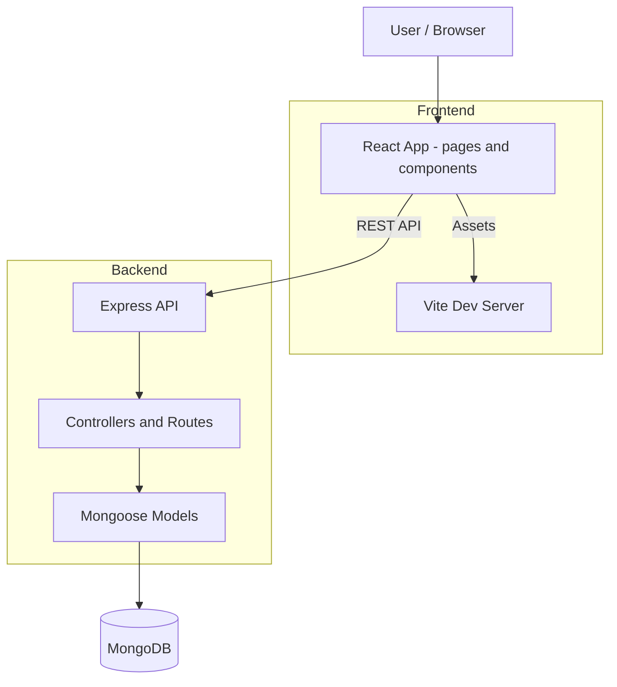
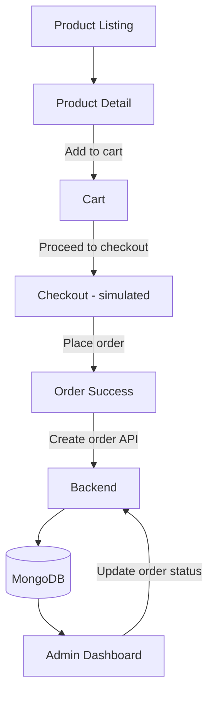

# Cartify. — E‑commerce Assignment

Live demo: 
- [Main site](https://cartify-e-commerce-application.vercel.app/) 
- [Admin dashboard](https://cartify-e-commerce-application.vercel.app/admin)

This repository is a concise, reviewer-focused full‑stack e‑commerce assignment demonstrating a maintainable product → cart → checkout → order flow. It uses a Vite + React frontend and an Express + Mongoose backend with MongoDB.

---

## About this submission

- **What I built:** a small full‑stack e‑commerce application called *Cartify* that supports product discovery, product detail pages, a client-side cart, a simulated checkout that creates orders in the backend, and a simple admin dashboard for viewing orders and managing products.
- **How it works:** the React frontend requests data from the Express API (`/api/products`, `/api/orders`); the backend uses Mongoose to persist `Product` and `Order` documents in MongoDB. Checkout is simulated — the frontend posts cart items to `POST /api/orders`, which stores an `Order` document.
- **Tech stack used:** React + Vite, Tailwind CSS, Node.js, Express, MongoDB (Mongoose), Axios. Dev tools: Vite, nodemon.
- **Assumptions made:** payment is simulated (no payment gateway), no authentication/authorization (admin pages are not protected), initial product data is seeded or added through the admin UI, and the environment provides a reachable MongoDB URI.
- **Submission / Author info:**
  - Name: Deshmukh Nikhil Dipak
  - Enrollment / ID: E22CSEU1099
  - Batch: B37
  - University / Organization: Bennett University
  - Role: Full Stack Developer Intern


**How this README is organized**

- **Quick setup**: run the app locally (frontend + backend)
- **Architecture & User flow**: clear Mermaid diagrams
- **Security**: immediate remediation for committed secrets
- **API & Data models**: routes and model summaries
- **Screenshots & Presentation**: placeholders, storage, and tips
- **Reviewer checklist**: concrete items for grading

---

**Quick setup — Development**

1) Backend

```bash
cd backend
npm install
# create backend/.env locally (copy from .env.example) and set MONGO_URI
npm run dev
```

2) Frontend

```bash
cd frontend
npm install
npm run dev
```

Open the Vite dev URL printed by the frontend (commonly `http://localhost:5173`). The frontend reads `VITE_API_BASE_URL` (see [frontend/.env](frontend/.env#L1)) and the API helper in [frontend/src/services/api.js](frontend/src/services/api.js#L1).

---

## Architecture (diagram)



---

## User flow (diagram)



---

## API overview (implemented routes)

- `GET /api/products` — list products (`backend/src/routes/product.routes.js`)
- `GET /api/products/:id` — product detail
- `POST /api/products` — create product
- `DELETE /api/products/:id` — delete product
- `POST /api/orders` — create order (`backend/src/routes/order.routes.js`)
- `GET /api/orders` — list orders (admin)

See controller files for request/response shapes: [backend/src/controllers/product.controller.js](backend/src/controllers/product.controller.js#L1), [backend/src/controllers/order.controller.js](backend/src/controllers/order.controller.js#L1).

---

## Data models (current)

- Product: `name`, `description`, `price`, `image`, `stock` — [backend/src/models/Product.js](backend/src/models/Product.js#L1)
- Order: `products` [{ `productId`, `quantity` }], `totalAmount` — [backend/src/models/Order.js](backend/src/models/Order.js#L1)

---

## Screenshots & Presentation (placeholders)

# Home Page


##

# Product Details


##

# Cart


# Place Order


##

# Admin Dashboard


- Orders


- Products


- Add Products


---

## Running & verification checklist (for reviewers)

- [ ] Backend starts (`npm run dev`) and connects to MongoDB.
- [ ] Frontend starts (`npm run dev`) and loads products from the API.
- [ ] Product detail pages load and `Add to cart` works.
- [ ] Cart prevents quantities exceeding `stock`.
- [ ] Checkout creates an `Order` document in MongoDB.
- [ ] Admin page shows new orders (if available).
- [ ] No secrets remain committed (verify `backend/.env` is removed from the index).

---

## Troubleshooting

- If the frontend shows empty data: confirm `VITE_API_BASE_URL` in [frontend/.env](frontend/.env#L1) points to the running backend.
- If DB connection fails: verify `MONGO_URI` in local `backend/.env` and network access to the cluster; check logs in [backend/src/config/db.js](backend/src/config/db.js#L1).

---

## Next steps I can do for you

- Create and commit `backend/.env.example` (no secrets).
- Remove `backend/.env` from repo history (prepare commands to run locally).
- Add server-side validation for `createOrder` to verify totals and quantities.
- Run a frontend build and provide the `dist` contents.

---

## 🧪 UX & Edge-Case Handling

- Empty states for Orders and Products
- Stock-aware cart limits
- Graceful loading skeletons
- Image fallback handling
- Admin dashboard with expandable order details
- Client-side routing support for direct URLs (/admin, /cart, etc.)

---

## ✅ Assignment Objectives Covered

- ✔ End-to-end flow
- ✔ Clean API design
- ✔ Frontend–backend integration
- ✔ Admin functionality
- ✔ Deployment-ready SPA routing
- ✔ Security awareness

---

## 📬 Next Improvements (Optional)

- Authentication & role-based access
- Order status updates
- Server-side validation
- Pagination on backend
- Unit & integration tests

> This assignment demonstrates my approach to building clean, scalable, and user-focused full-stack applications.
