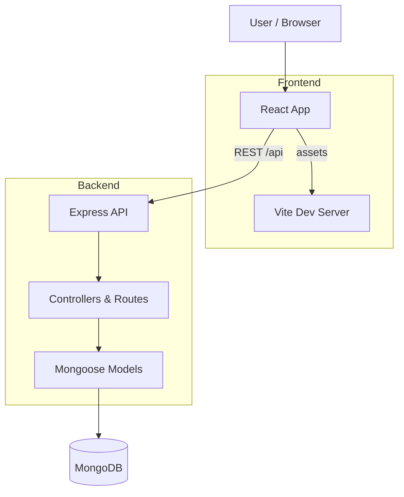

# Cartify — E‑commerce Assignment

Live demo (local): [Main site](http://localhost:5173) · [Admin dashboard](http://localhost:5173/admin)

This repository is a concise, reviewer-focused full‑stack e‑commerce assignment demonstrating a maintainable product → cart → checkout → order flow. It uses a Vite + React frontend and an Express + Mongoose backend with MongoDB.

---

**Quick summary**

- Stack: React + Vite (frontend), Node.js + Express (backend), MongoDB (Mongoose). Tailwind CSS utilities.
- Purpose: assignment submission for company review — emphasise functionality, code clarity, and secure handling of secrets.

---

**Repo layout**

- `backend/` — Express app, controllers, routes, Mongoose models. Entry: [backend/src/server.js](backend/src/server.js#L1).
- `frontend/` — Vite React app, components, pages, theme CSS. Entry: [frontend/src/main.jsx](frontend/src/main.jsx#L1).

---

## Prerequisites

- Node.js 16/18+ and npm (or pnpm/yarn)
- MongoDB connection string (`MONGO_URI`) for local or Atlas

---

## Local development — quick start

1) Backend

```bash
cd backend
npm install
# copy backend/.env.example -> backend/.env and set MONGO_URI (do NOT commit secrets)
npm run dev
```

2) Frontend

```bash
cd frontend
npm install
npm run dev
```

Open the Vite URL printed by the frontend (commonly `http://localhost:5173`). The frontend reads `VITE_API_BASE_URL` (see [frontend/.env](frontend/.env#L1)) and uses the API helper in [frontend/src/services/api.js](frontend/src/services/api.js#L1).

---

## Build / Production

```bash
cd frontend
npm run build
# serve frontend/dist or integrate with backend

cd ../backend
npm run start
```

---

## Project review — what I inspected

- Backend: entry, routes, controllers, models, DB connection ([backend/src/server.js](backend/src/server.js#L1), [backend/src/app.js](backend/src/app.js#L1), [backend/src/config/db.js](backend/src/config/db.js#L1)).
- Frontend: entry, routing, cart logic, API helper ([frontend/src/main.jsx](frontend/src/main.jsx#L1), [frontend/src/App.jsx](frontend/src/App.jsx#L1), [frontend/src/services/api.js](frontend/src/services/api.js#L1)).
- Found a committed environment file at [backend/.env](backend/.env#L1) — see Security below.

---

## Security — immediate remediation required

The repo contains `backend/.env` with `MONGO_URI`. Treat it as leaked.

Run locally to remove it from the index and ignore it going forward:

```bash
git rm --cached backend/.env
git commit -m "chore(secrets): remove backend .env from repository"
printf "backend/.env\n" >> .gitignore
git add .gitignore
git commit -m "chore: ignore backend .env"
```

Rotate the MongoDB credentials in your DB provider immediately. If this repository was pushed publicly, remove the secret from history using `git filter-repo` or BFG and rotate credentials.

---

## Architecture (diagram)



---

## User flow (diagram)

```mermaid
flowchart LR
  PL[Product Listing] --> PD[Product Detail]
  PD -->|Add to cart| C[Cart]
  C -->|Proceed to checkout| CO[Checkout (simulated)]
  CO -->|Place Order| OS[Order Success]
  OS -->|POST /api/orders| B[Backend]
  B --> DB[(MongoDB)]
  DB --> ADM[Admin Dashboard]
  ADM -->|update status| B
```

---

## API overview (implemented routes)

- `GET /api/products` — list products
- `GET /api/products/:id` — product detail
- `POST /api/products` — create product
- `DELETE /api/products/:id` — delete product
- `POST /api/orders` — create order
- `GET /api/orders` — list orders (admin)

See backend route files for exact request/response shapes.

---

## Data models (current)

- Product: `name`, `description`, `price`, `image`, `stock` ([backend/src/models/Product.js](backend/src/models/Product.js#L1))
- Order: `products` (productId, quantity), `totalAmount` ([backend/src/models/Order.js](backend/src/models/Order.js#L1))

---

## Screenshots & Presentation

When presenting the project (demo, PDF, or PR), include screenshots that demonstrate the main reviewer flows. Recommended storage and embed:

- Store images in `frontend/public/screenshots/`.
- Reference in README or markdown using a root-relative path (Vite serves `/` from `public`):

```markdown

```

Recommended captures and captions:

- Home / product listing — hero + grid (Caption: "Home — browse products")
- Product detail — images, price, add-to-cart (Caption: "Product detail — add to cart")
- Cart — items, totals, quantity controls (Caption: "Cart — adjust quantities and checkout")
- Checkout / Order success — confirmation (Caption: "Order success — backend order created")
- Admin — orders list and status update (Caption: "Admin — process orders")

Tips:

- Use PNG for UI clarity; aim for ~1200px width.
- Include short reproduction steps next to each screenshot.
- If you provide a live demo link, show it near the images so reviewers can validate behavior.

---

## Troubleshooting & reviewer notes

- If frontend shows no products: ensure backend runs and `VITE_API_BASE_URL` points to the running backend ([frontend/.env](frontend/.env#L1)).
- If DB connection fails: verify `MONGO_URI` and network access to the MongoDB cluster; check logs in [backend/src/config/db.js](backend/src/config/db.js#L1).
- The frontend enforces `stock` checks before adding to cart; set realistic `stock` values in DB for testing.

---

## Next actions I can take for you

- Create and commit `backend/.env.example` (no secrets)
- Remove `backend/.env` from git history locally (I can prepare commands)
- Add basic server-side validation for `createOrder` to verify totals
- Run `npm run build` for the frontend and verify output

Tell me which action you'd like next and I'll proceed.
# Cartify — E‑commerce Assignment

Concise, reviewer-focused documentation for a full‑stack e‑commerce assignment. This repository demonstrates a maintainable e‑commerce flow (product listing, product detail, cart, simulated checkout, order creation, admin order processing) using a Vite + React frontend and an Express + Mongoose backend with MongoDB.

---

**Project snapshot**

- Stack: React + Vite (frontend), Node.js + Express (backend), MongoDB with Mongoose, Tailwind CSS utilities.
- Purpose: assignment submission for code review and functional evaluation — product discovery → cart → checkout → order persistence → admin processing.

---

**Repo layout (high level)**

- `backend/` — Express app, controllers, routes, Mongoose models. Entry: [backend/src/server.js](backend/src/server.js#L1).
- `frontend/` — Vite React app, components, pages, theme CSS. Entry: [frontend/src/main.jsx](frontend/src/main.jsx#L1).

---

**Prerequisites**

- Node.js 16/18 LTS or newer
- npm (or pnpm/yarn)
- MongoDB connection (Atlas or local) and a `MONGO_URI`

---

## Quick setup — Development

1) Backend

```bash
cd backend
npm install
# copy backend/.env.example -> backend/.env and set MONGO_URI (do NOT commit secrets)
npm run dev
```

2) Frontend

```bash
cd frontend
npm install
npm run dev
```

Open the frontend dev URL (Vite prints it; commonly `http://localhost:5173`). The frontend uses `VITE_API_BASE_URL` (see [frontend/.env](frontend/.env#L1)) and the API helper at [frontend/src/services/api.js](frontend/src/services/api.js#L1).

---

## Build / Production

```bash
cd frontend
npm run build
# serve frontend/dist via static host or integrate with Express

cd ../backend
npm run start
```

---

## Project review summary (what I inspected)

- Confirmed backend package and scripts: [backend/package.json](backend/package.json#L1)
- Confirmed Express app mounts routes at `/api/products` and `/api/orders` in [backend/src/app.js](backend/src/app.js#L1)
- Confirmed DB connect logic in [backend/src/config/db.js](backend/src/config/db.js#L1)
- Confirmed frontend routing and cart logic in [frontend/src/App.jsx](frontend/src/App.jsx#L1)
- Confirmed API helper reads `VITE_API_BASE_URL` in [frontend/src/services/api.js](frontend/src/services/api.js#L1)

---

## Security — critical

I found a committed environment file with credentials at: [backend/.env](backend/.env#L1).

Immediate actions (run now):

```bash
# remove the .env file from the git index but keep a local copy
git rm --cached backend/.env
git commit -m "chore(secrets): remove backend .env from repository"

# ensure future commits ignore it
printf "backend/.env\n" >> .gitignore
git add .gitignore
git commit -m "chore: ignore backend .env"
```

After the above, rotate the MongoDB credentials in your cloud provider and update the local `backend/.env` with the new values.

If the repo was pushed to a public remote, remove the secret from history using `git filter-repo` or BFG and force-push the cleaned history. Notify stakeholders of the leak and credential rotation.

---

## Architecture (diagram)

```mermaid
flowchart TD
	U[User / Browser]
	subgraph Frontend
		V[Vite Dev Server]
		R[React App (pages & components)]
	end
	subgraph Backend
		B[Express API]
		C[Controllers & Routes]
		M[Mongoose Models]
	end
	DB[(MongoDB)]

	U --> R
	R -->|REST /api| B
	B --> C
	C --> M
	M --> DB
	R -->|assets| V
```

---

## User flow (diagram)

```mermaid
flowchart LR
	PL[Product Listing] --> PD[Product Detail]
	PD -->|Add to cart| C[Cart]
	C -->|Proceed to checkout| CO[Checkout (simulated)]
	CO -->|Place Order| OS[Order Success]
	OS -->|POST /api/orders| B[Backend]
	B --> DB[(MongoDB)]
	DB --> ADM[Admin Dashboard]
	ADM -->|update status| B
```

---

## API overview (implemented routes)

- `GET /api/products` — list products — implemented in [backend/src/routes/product.routes.js](backend/src/routes/product.routes.js#L1)
- `GET /api/products/:id` — product detail
- `POST /api/products` — create product
- `DELETE /api/products/:id` — delete product
- `POST /api/orders` — create order — implemented in [backend/src/routes/order.routes.js](backend/src/routes/order.routes.js#L1)
- `GET /api/orders` — list orders (admin)

Request/response shapes are straightforward JSON objects; consult controller files for exact fields.

---

## Data models (current)

- Product (`backend/src/models/Product.js`):
	- `name` (String)
	- `description` (String)
	- `price` (Number)
	- `image` (String)
	- `stock` (Number)

- Order (`backend/src/models/Order.js`):
	- `products`: [{ `productId` (ObjectId), `quantity` (Number) }]
	- `totalAmount` (Number)

---

## Troubleshooting & reviewer notes

- If frontend shows no products: ensure backend is running and reachable at `VITE_API_BASE_URL` (see [frontend/.env](frontend/.env#L1)).
- If DB connection fails: check `backend/.env` `MONGO_URI` and network access to the MongoDB cluster; DB connection logs are in [backend/src/config/db.js](backend/src/config/db.js#L1).
- The frontend prevents adding more units to cart than `stock`; confirm `stock` values in DB for realistic testing.

---


